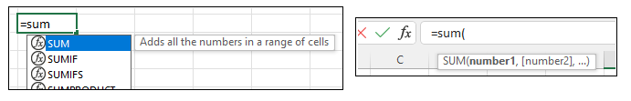
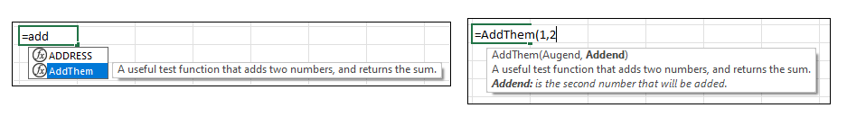

import Tabs from '@theme/Tabs';
import TabItem from '@theme/TabItem';

Excel includes a feature that enables users to utilise functions more effectively by displaying pop-up description regarding the function and its parameters. Examples of IntelliSense in action can be seen in the figure below:



By default, Excel does not provide native IntelliSense functionality to user-defined functions (UDFs). As a result, a custom [Excel-DNA IntelliSense](https://github.com/Excel-DNA/IntelliSense) library was created as part of the Excel-DNA project.

## Usage

Using Excel-DNA's IntelliSense capabilities is relatively simple and requires just 3 steps.

1. Depending on the language of choice, in the .csproj, .vbproj, or .fsproj file, add the following under *</PropertyGroup\>*:
```xml
<ItemGroup>
    <PackageReference Include="ExcelDna.IntelliSense" Version="*-*" />
</ItemGroup>
```
2. Add a new class file to the solution by pressing Ctrl+Shift+A and include the following code:

<Tabs>
<TabItem value="csharp" label="C#">

```csharp
using ExcelDna.Integration;
using ExcelDna.IntelliSense;

public class IntelliSenseAddIn : IExcelAddIn
{
    public void AutoOpen()
    {
        IntelliSenseServer.Install();
    }
    public void AutoClose()
    {
        IntelliSenseServer.Uninstall();
    }   
}
```

</TabItem>
<TabItem value="vbnet" label="VB.Net">

```vbnet
Imports ExcelDna.Integration
Imports ExcelDna.IntelliSense

Public Class IntelliSenseAddIn
    Implements IExcelAddIn

    Public Sub AutoOpen() Implements IExcelAddIn.AutoOpen
        IntelliSenseServer.Install()
    End Sub

    Public Sub AutoClose() Implements IExcelAddIn.AutoClose
        IntelliSenseServer.Uninstall()
    End Sub
End Class
```

</TabItem>
<TabItem value="fsharp" label="F#">

```fsharp
TO DO
```

</TabItem>
</Tabs>

3. Decorate the UDF with the ```ExcelFunction``` and ```ExcelArgument``` as per the example code snippet below:

<Tabs>
<TabItem value="csharp" label="C#">

```csharp
[ExcelFunction(Description = "A useful test function that adds two numbers, and returns the sum.")]
public static double AddThem(
	[ExcelArgument(Name = "Augend", Description = "is the first number, to which will be added")] 
	double v1,
	[ExcelArgument(Name = "Addend", Description = "is the second number that will be added")]     
	double v2)
{
	return v1 + v2;
}
```

</TabItem>
<TabItem value="vbnet" label="VB.Net">

```vbnet
<ExcelFunction(Description:="A useful test function that adds two numbers, and returns the sum.")>
Public Shared Function AddThem(
    <ExcelArgument(Name:="Augend", Description:="is the first number, to which will be added")>
    v1 As Double,
    <ExcelArgument(Name:="Addend", Description:="is the second number that will be added")>
    v2 As Double) As Double

    Return v1 + v2
End Function
```

</TabItem>
<TabItem value="fsharp" label="F#">

```fsharp
[<ExcelFunction(Description="A useful test function that adds two numbers, and returns the sum.")>]
let AddThem (
    [<ExcelArgument(Name="Augend", Description="is the first number, to which will be added")>]
    v1:double) (
    [<ExcelArgument(Name="Addend", Description="is the second number that will be added")>]
    v2:double) = v1 + v2
```

</TabItem>
</Tabs>

The example above would generate the following IntelliSense output:



## Additional Remarks

If the UDF is decorated as per step 3 above but the first 2 steps are skipped, it would still be possible to get limited information regarding the UDF. The information can be seen by writing the name of the function in Excel's Forumla Bar and clicking on the ```fx``` button (highlighted in red). The result can be seen in the figure below:


