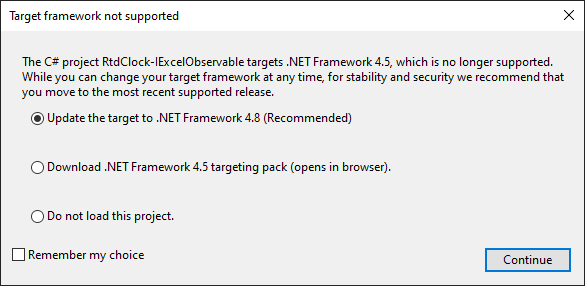
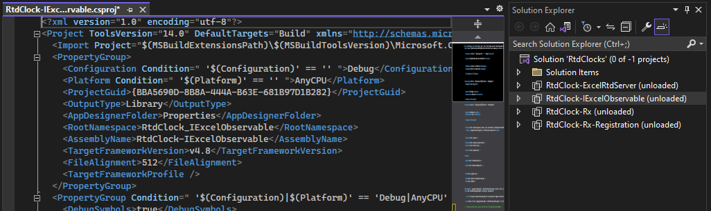
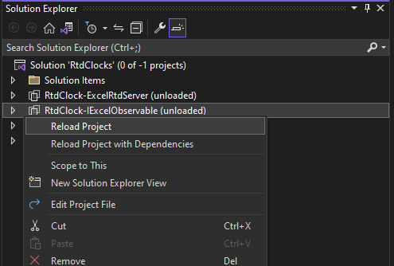
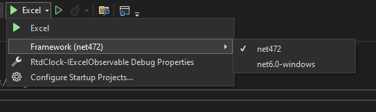

.NET SDK-style projects are a new project format introduced with .NET Core 2.0, which allows developers to build and manage .NET projects in a simplified way. Unlike the traditional .NET Framework project format, which requires a complex XML-based configuration file, SDK-style projects use a simpler and more intuitive format based on a set of pre-defined templates.

Each project is inherently different however, at times the steps taken toward updating the project may be similar in various cases. The steps below demonstrate the steps taken to convert [RTDClock-IExcelObervable](https://github.com/Excel-DNA/Samples/tree/master/RtdClocks/RtdClock-IExcelObservable) (part of the RTDClocks solution, which can be found in [Excel-DNA's Samples repository](https://github.com/Excel-DNA/Samples)) from the XML-based configuration file to its equivalent SDK-style:

## Conversion Steps

1. Open the RtdClocks solution in Visual Studio. While loading the solution, a question regarding unsupported framework may pop-up for each of the projects within the solution. In that case, select 'Do not load this project.' for all other projects but RtdClock-IExcelObervable, where the selection should be as per the figure below:
    

2. When selecting RtdClock-IExcelObervable in the Solution Explorer window (notice: all projects will be marked as unloaded), the .csproj file content will appear, showing the traditional XML-based syntax like so:
   

**Note:** To view the content of a .csproj file for projects that are not formatted with the .NET SDK-style, it is required that the project be unloaded in Visual Studio.

3. Replace the content of the file with the following:

```xml
<Project Sdk="Microsoft.NET.Sdk">

	<PropertyGroup>
		<TargetFrameworks>net472;net6.0-windows</TargetFrameworks>
	</PropertyGroup>
	
</Project>
```
Notice that between the <TargetFramworks\> tags 2 values exist. By targeting both frameworks, the project can be built and run on both older Windows systems that support .NET Framework 4.7.2, as well as newer systems that support .NET 6.0. that is optimised specifically for Windows.

**Note:** Replacing the old XML format with the new SDK-style does not require the target framework to change. It is also important to remember that the targeted framework values are dependent on several factors, such as the features and APIs required by the project, the platform on which the application will be deployed, and the compatibility requirements of any libraries or dependencies used by the project.

4. Reload the project by right-clicking on the project in Solution Explorer and then selecting 'Reload Project':
    

5. A list of dependencies exists in the packages.config file:

   ```xml
   <?xml version="1.0" encoding="utf-8"?>
   <packages>
     <package id="ExcelDna.AddIn" version="1.1.1" targetFramework="net45" developmentDependency="true" />
     <package id="ExcelDna.Integration" version="1.1.0" targetFramework="net45" />
   </packages>
   ```

   These dependencies need to be included in the SDK-style .csproj file. Specifically for this project, only ExcelDna.AddIn is required. Include the following lines to the .csproj between the <Project\> tags:

   ```xml
   <ItemGroup>
   	<PackageReference Include="ExcelDna.Addin" Version="*-*" />
   </ItemGroup>
   ```

6. Delete the following files from the project as they are no longer required:

   * packages.json
   * RtdClock-IExcelObservable-AddIn.dna
   * Properties/AssemblyInfo.cs
   * Properties/ExcelDna.Build.props (**Note:** Any customized content should be added to the .csproj file)

7. Similar to Step 4, right-click on the project in Solution Explorer and select 'Rebuild'. 

8. Once the project was built successfully, it is possible to select which of the target frameworks (were set in Step 3), should the project run under:

    


## Converting the Entire Solution

Converting the entire solution requires a few modifications to the steps described above. 

* In Step 1, ensure to select the same update option for all projects rather than 'Do not load this project.'.

* In Step 5, specifically for [RtdClock-Rx](https://github.com/Excel-DNA/Samples/tree/master/RtdClocks/RtdClock-Rx) and [RtdClock-Rx-Registration](https://github.com/Excel-DNA/Samples/tree/master/RtdClocks/RtdClock-Rx-Registration), the dependencies list includes a few more libraries. Ensure to include them in addition to further modifications as per below:

  **RtdClock-Rx**

  ```xml
  <!-- Add a PropertyGroup that will only be active for the net472 target framework 
       Set up the additional assemblies to pack
       We want to include all libraries in the output directory
       (For .NET 6 we use the .deps.json file to find the assemblies to pack, so this property is not needed)
  -->
  	<PropertyGroup Condition="'$(TargetFramework)' == 'net472'">
     		<ExcelAddInInclude>System.Reactive.dll;System.Runtime.CompilerServices.Unsafe.dll;System.Threading.Tasks.Extensions.dll</ExcelAddInInclude>
  	</PropertyGroup>
  
  	<ItemGroup>
  		<PackageReference Include="ExcelDna.Addin" Version="*-*" />
  		<PackageReference Include="System.Reactive" Version="*-*" />
  	</ItemGroup>
  ```

  **RtdClock-Rx-Registration**

  ```xml
  <!-- This property prevents the auto-registration of Excel functions (by default all public static functions)
       We will use the Registration helper and a call in the AutoOpen method to register functions explicitly 
  -->
  	<PropertyGroup>
  		<ExcelAddInExplicitRegistration>true</ExcelAddInExplicitRegistration>
  	</PropertyGroup>
  
  <!-- Add a PropertyGroup that will only be active for the net472 target framework 
       Set up the additional assemblies to pack
       We want to include all libraries in the output directory
       (For .NET 6 we use the .deps.json file to find the assemblies to pack, so this property is not needed)
  -->
  	<PropertyGroup Condition="'$(TargetFramework)' == 'net472'">
  		<ExcelAddInInclude>ExcelDna.Registration.dll;System.Reactive.dll;System.Runtime.CompilerServices.Unsafe.dll;System.Threading.Tasks.Extensions.dll</ExcelAddInInclude>
  	</PropertyGroup>
    
  	<ItemGroup>
  		<PackageReference Include="ExcelDna.Addin" Version="*-*" />
  		<PackageReference Include="ExcelDna.Registration" Version="*-*" />
  		<PackageReference Include="System.Reactive" Version="*-*" />
  	</ItemGroup>
  ```

* In Step 6, make sure the relevant .dna files are deleted.

